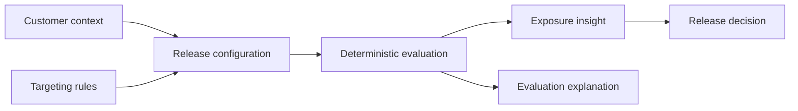
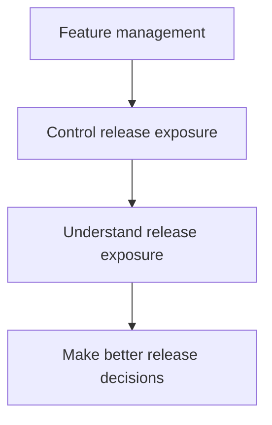
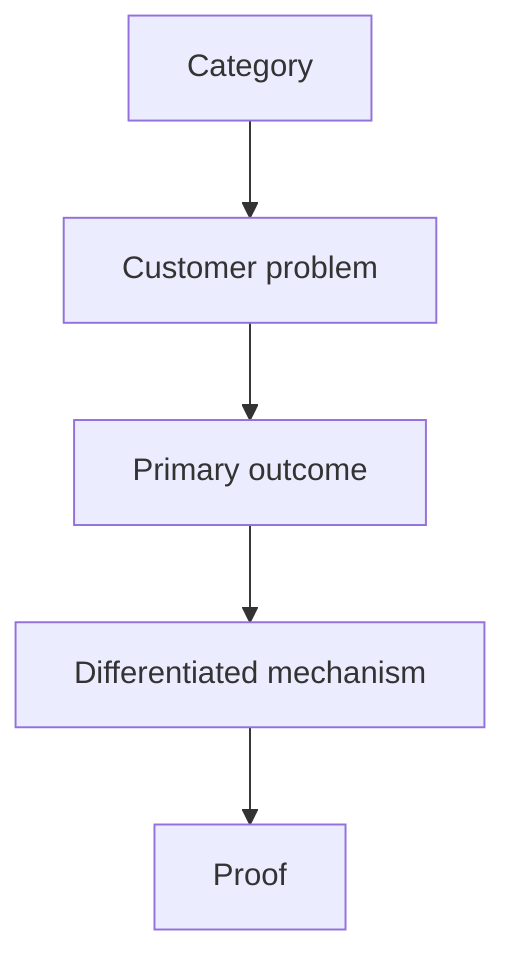

# flags.dev — Product Positioning

## 1. Purpose

This document defines how flags.dev should be understood and differentiated in the feature-management market.

It translates the product thesis into a concise market position without positioning flags.dev as a clone of an established feature-flag vendor or as a generic analytics platform.

---

## 2. Category

### Primary category

**Feature-flag platform**

Feature flags remain the clearest category for explaining what flags.dev does and where it fits in an engineering stack.

### Differentiated position

**A feature-flag platform focused on understanding release exposure and improving release decisions.**

The category provides immediate recognition. The differentiated position explains why flags.dev exists beyond basic flag management.

We should not introduce an abstract category such as **"Release Intelligence platform"** as the primary market category. Release Intelligence is a product direction that can be earned through concrete capabilities rather than a category customers are expected to understand before using the product.

---

## 3. Positioning Statement

> **For engineering teams that need to control production feature releases without losing visibility into their impact, flags.dev is a feature-flag platform that makes release exposure understandable before and after a rollout. Unlike a feature-flag system positioned primarily around controlling exposure, flags.dev combines context-aware targeting, deterministic evaluation, exposure analysis, simulation, and explainability to help teams make better release decisions.**

This is the internal positioning statement. It is not intended to be used verbatim as landing-page copy.

---

## 4. Core Value Proposition

### Primary promise

> **Understand the impact of your rollout before you change it.**

### Supporting promise

> **Know who your release will affect, how much exposure it creates, what changes when you modify targeting or rollout, and why individual contexts receive a variation.**

### Short product expression

> **Don't just control your rollout. Understand its impact.**

The short expression is deliberately outcome-oriented. It does not claim that flags.dev replaces analytics, experimentation, or customer-data infrastructure.

---

## 5. The Customer Problem in One Sentence

> **Feature flags make release exposure controllable, but release exposure is often difficult to understand before a rollout decision is made.**

This is the problem the positioning should make visible.

---

## 6. The Product Difference

The differentiation is not that flags.dev can perform generic audience queries. Customers can already query their own data.

The differentiated capability is the connection between customer context and the **specific release configuration** being evaluated.



The product should make questions such as these easy to answer:

- **Who?** Who matches this release configuration?
- **How much?** How much exposure does the current rollout create?
- **What if?** What changes if targeting or rollout changes?
- **Why?** Why did this context receive this variation?

This connection is the core differentiator.

---

## 7. Positioning Pillars

### 7.1 Context-aware releases

Treat evaluation context as a first-class product concept rather than limiting targeting to a single user identity.

Contexts can represent users, organizations, devices, or other application entities and can contain attributes relevant to release decisions.

**Customer value:** more precise targeting and a foundation for release-specific exposure analysis.

---

### 7.2 Release exposure visibility

Show the expected audience and exposure associated with a release configuration where sufficient customer context data is available.

**Customer value:** understand the practical meaning of a rollout percentage instead of treating it as an abstract number.

Exposure estimates must identify their basis and remain distinct from authoritative population counts.

---

### 7.3 What-if release simulation

Allow teams to compare configurations before applying them.

```text
Current
15% rollout
~180K projected exposure

        ↓ simulate

Proposed
25% rollout
~300K projected exposure

        ↓

Additional exposure
~120K
```

**Customer value:** evaluate the consequence of a rollout change before committing it.

---

### 7.4 Explainable evaluation

Make individual evaluation decisions understandable.

```text
Context: user-123
        ↓
Matched targeting conditions
        ↓
Matched rule
        ↓
Deterministic rollout decision
        ↓
Variation: ON
```

**Customer value:** reduce uncertainty when debugging, validating targeting, or investigating unexpected exposure.

---

### 7.5 Developer-first integration

The product should remain easy to integrate through a stable evaluation contract, APIs, and the planned Java SDK. A future OpenFeature provider can provide a vendor-neutral integration path.

**Customer value:** adopt the evaluation layer without coupling application architecture to a proprietary storage model.

---

## 8. Competitive Positioning

flags.dev should not position itself as:

> **"A better LaunchDarkly."**

Nor should it claim that established vendors cannot provide similar individual capabilities.

The differentiation should instead be based on **what flags.dev is deliberately optimized around**.



Established feature-flag platforms define a mature category. flags.dev enters that category with a deliberate emphasis on the connection between:

**context → targeting → evaluation → exposure → release decision**.

The positioning should therefore avoid feature-count comparisons as the primary argument.

---

## 9. What We Do Not Compete On

The following should not be primary positioning claims:

### Price

Being cheaper than an established vendor is not a durable product thesis.

### Feature count

A larger checklist of integrations, SDKs, dashboards, and enterprise controls does not create our differentiation.

### Generic analytics

flags.dev does not compete with data warehouses, BI platforms, CDPs, or product analytics systems.

### AI branding

The product should not use AI as a differentiator unless it solves a concrete release problem better than deterministic product capabilities can.

### Vendor replacement claims

We should not claim that established feature-flag platforms are incapable of solving problems that flags.dev addresses. The position is about our focus, not unsupported claims about competitors.

---

## 10. Positioning Hierarchy

All external messaging should follow this hierarchy:



### Category

Feature-flag platform.

### Problem

Teams can control rollout exposure but may not understand its consequences.

### Outcome

Make release exposure understandable and make rollout decisions with greater confidence.

### Differentiated mechanism

Context-aware targeting + deterministic evaluation + exposure analysis + simulation + explainability.

### Proof

Working evaluation infrastructure, deterministic behavior, integration contracts, performance evidence, and eventually concrete release-impact workflows.

---

## 11. Messaging by Audience

### Engineering / Platform

Emphasize:

- deterministic evaluation
- context model
- explainability
- rollout simulation
- stable evaluation contract
- integration and SDKs
- production reliability

Core question:

> **Can I trust and reason about the release decision?**

### Engineering Manager / Technical Lead

Emphasize:

- safer rollout decisions
- exposure visibility
- targeting impact
- reduced operational uncertainty
- faster investigation of unexpected exposure

Core question:

> **Can my team make rollout decisions with less uncertainty?**

### Product / Business stakeholder

Emphasize only where supported by actual product capabilities:

- expected release reach
- audience composition
- exposure changes
- release decision visibility

Core question:

> **What customer population will this release affect?**

The product should not promise business outcomes that it cannot measure.

---

## 12. Message Architecture

The public-facing story should move from business problem to technical proof.

```text
Release decision
      ↓
Who will be affected?
      ↓
How much exposure will it create?
      ↓
What happens if I change it?
      ↓
Why did this context receive it?
      ↓
How does flags.dev make this reliable?
```

Technical capabilities such as Redis, caching, APIs, SDKs, and deterministic evaluation should support the story as proof of reliability and developer experience rather than appear as the primary value proposition.

---

## 13. Claims We Can Make

Messaging can confidently communicate the following when the corresponding capability is implemented and available:

- Feature-flag-based release control.
- Context-aware targeting.
- Deterministic evaluation.
- Percentage rollout.
- Explainable evaluation decisions.
- Release exposure analysis based on available customer context data.
- What-if rollout and targeting analysis.
- Customer-system-agnostic context ingestion.
- Developer-facing APIs and the planned Java SDK.

Future capabilities must be clearly identified as planned or in development until they are available.

---

## 14. Claims We Should Avoid

Do not claim:

- Exact total customer population counts without authoritative data.
- Guaranteed business outcomes from a rollout.
- Complete experimentation capabilities before they exist.
- Predictive intelligence without sufficient evidence.
- Universal compatibility with every customer data system unless a supported integration exists.
- That flags.dev is categorically superior to established vendors.

Trust is part of the positioning. The product should distinguish facts, estimates, and future capabilities.

---

## 15. Positioning Decision

The current positioning direction is:

> **flags.dev is a feature-flag platform focused on helping engineering teams understand release exposure and make better release decisions.**

The primary product promise is:

> **Understand the impact of your rollout before you change it.**

The long-term direction is **Release Intelligence**, but this term should describe the evolution of the product rather than replace the familiar feature-flag category.

The differentiating relationship is:

```text
Feature flags
      ↓
Context
      ↓
Targeting
      ↓
Evaluation
      ↓
Exposure
      ↓
Release decision
```

---

## 16. Validation Requirements

This positioning remains a product hypothesis until validated with real developers and teams.

Validation should test:

1. Whether customers recognize release exposure as a meaningful problem.
2. Whether the exposure-preview concept is immediately understandable.
3. Whether developers trust exposure estimates when their data source and limitations are explicit.
4. Whether what-if rollout analysis changes real release decisions.
5. Whether explainable evaluation reduces investigation time.
6. Which customer segment experiences the problem strongly enough to adopt the product.

The landing page should be designed to test these assumptions rather than merely repeat them.
