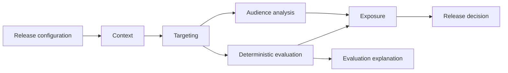
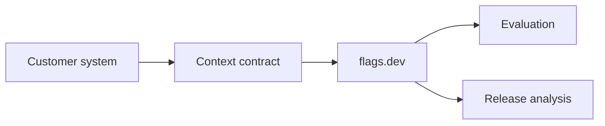
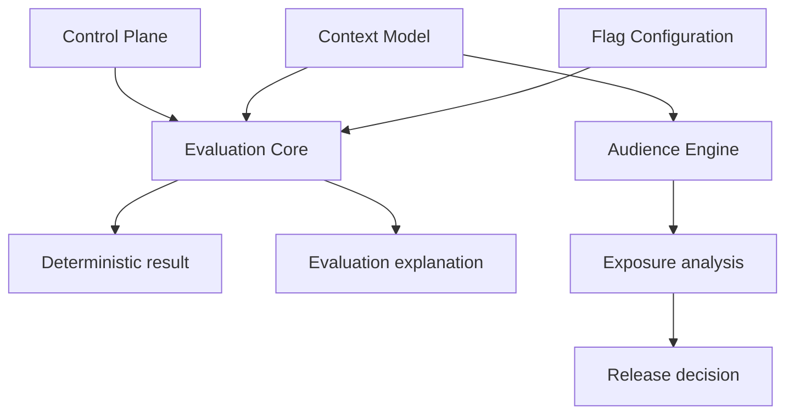
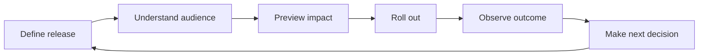

# flags.dev — Product Thesis

## 1. Purpose

flags.dev is a feature-flag platform designed to help engineering teams make better release decisions.

Feature flags provide control over feature exposure. flags.dev extends that control with context-aware understanding of release exposure: who is targeted, how much of the available audience is affected, how configuration changes alter exposure, and why an individual context receives a variation.

> **Don't just control your rollout. Understand its impact.**

---

## 2. The Problem

A conventional feature-release workflow is:

```text
Create flag
    ↓
Define targeting
    ↓
Set rollout
    ↓
Evaluate
    ↓
Release
```

The evaluator can determine whether a context receives a variation. The harder release questions are:

- Who will receive this release?
- How large is the matching audience?
- What does a 15% rollout mean for this audience?
- What changes if the rollout moves from 15% to 25%?
- How does changing a targeting rule alter exposure?
- Why did a specific context receive a variation?

Teams with mature data infrastructure can answer parts of these questions elsewhere. flags.dev aims to make release-specific questions useful out of the box without becoming a replacement for that infrastructure.

---

## 3. Initial Customer Profile

### Primary ICP

**Engineering-led teams shipping frequently where rollout mistakes have meaningful customer or business consequences.**

### Strongest initial segment

**Growing and mid-market B2B SaaS companies, particularly multi-tenant products.**

These systems commonly evaluate releases using multiple dimensions such as:

```text
user
tenant
plan
role
country
platform
environment
```

As targeting becomes more specific, understanding exposure becomes more valuable than a simple rollout percentage.

### Likely champions

- Staff / Principal Engineers
- Platform or Developer Experience engineers
- Engineering Managers
- Engineers responsible for production releases

This is an initial market hypothesis and requires validation with real users.

---

## 4. Trigger Event

The strongest trigger is a production release decision where the team needs to understand the consequences before changing exposure.

Typical cases include:

- Increasing rollout from 10% to 25%.
- Adding or removing a targeting condition.
- Investigating why a customer received a feature.
- Investigating unexpected exposure after a release.

The underlying question is:

> **What will this release actually affect?**

---

## 5. Product Thesis

The product thesis is:

> **flags.dev makes release exposure predictable, inspectable, and explainable by combining feature-flag evaluation with customer-provided context.**

Feature flags remain the control mechanism. The differentiated product experience is the ability to understand the consequences of release configuration.



---

## 6. Core Product Questions

flags.dev should progressively answer four questions:

| Question | Product capability |
|---|---|
| **Who?** | Audience and targeting analysis |
| **How much?** | Exposure estimation |
| **What if?** | Rollout and targeting simulation |
| **Why?** | Explainable evaluation |

These capabilities are valuable because they are directly connected to a specific release configuration.

A generic query such as:

```sql
SELECT COUNT(*)
FROM users
WHERE country = 'IN'
  AND age BETWEEN 21 AND 30;
```

is not the product. Customers can already perform generic analysis in their own data stack.

The product value comes from combining that information with the actual flag, targeting rules, and rollout configuration.

---

## 7. Release Intelligence

**Release Intelligence** is the long-term product direction, not a generic analytics category.

### Release Impact Preview

```text
Targeting:
country = IN
age = 21–30
plan = PRO

Rollout: 15%

Matching contexts:       1,200,000
Projected exposure:        ~180,000
```

### What-if simulation

```text
Current rollout       15%       ~180K
Proposed rollout      25%       ~300K
Additional exposure             ~120K
```

### Targeting impact

```text
Current targeting       1.2M
Add plan = PRO           420K
Audience change          -65%
```

### Explainable evaluation

```text
Context: user-123
        ↓
country = IN          ✓
age = 26               ✓
Matched targeting rule
Rollout bucket within threshold
        ↓
Variation: ON
```

The goal is not generic analytics. The goal is to make release decisions easier to understand and operate.

---

## 8. Context as a First-Class Domain Concept

A context represents the entity being evaluated.

```json
{
  "kind": "user",
  "key": "user-123",
  "attributes": {
    "country": "IN",
    "age": 26,
    "plan": "PRO",
    "platform": "ANDROID"
  }
}
```

The model must remain extensible beyond users to support entities such as organizations and devices.

Contexts serve two related purposes:

1. **Evaluation input** — determine the variation for an individual context.
2. **Release-analysis input** — where enabled, analyze a customer-provided context population.

---

## 9. Customer-System Agnostic

flags.dev must not require direct access to a customer's application database.

The platform should not be designed around database-specific integrations such as:

```text
flags.dev → customer PostgreSQL
flags.dev → customer MongoDB
flags.dev → customer DynamoDB
```

Instead, the boundary is a context contract:



Customers control how relevant context data reaches flags.dev. Future mechanisms may include SDKs, APIs, batch ingestion, or other integrations, but the core platform must not depend on the customer's storage technology.

**Audience intelligence should enhance adoption, not become a prerequisite for basic evaluation.**

---

## 10. Audience Data and Trust

flags.dev must distinguish between data it receives, data it derives, and estimates it produces.

### Customer-provided context

The primary source for targeting and release analysis.

### Evaluation metadata

flags.dev may generate metadata such as:

- flag and environment
- context identity
- evaluation result and reason
- rollout bucket
- SDK/source
- evaluation timestamp

### External demographic data

External population or demographic datasets are not part of the core product model. flags.dev must not imply knowledge of a customer's total market population unless that information is explicitly supplied through a future supported source.

### Known population vs total population

If flags.dev has access to 2 million customer-provided contexts and 400,000 match a rule, the product should communicate:

> **400,000 available contexts match this targeting rule.**

It should not claim that the customer's total user population is 400,000 unless the underlying data is authoritative and complete.

Estimates must identify their basis, freshness, and limitations where relevant.

---

## 11. Product Boundaries

flags.dev is **not** intended to become:

- A generic BI platform
- A data warehouse
- A customer-data platform (CDP)
- A customer database
- A replacement for product analytics
- A generic experimentation platform
- A demographic-data provider
- A database-integration platform
- A feature-count clone of mature vendors
- An AI product without a concrete release problem

The product boundary is:

> **Does this capability help a developer or business understand, control, or explain release exposure?**

If not, it requires separate justification before entering the roadmap.

---

## 12. Engineering Principles

The product direction requires a clean separation between configuration, evaluation, and release analysis.



Key principles:

- Evaluation semantics remain deterministic and independent of customer storage technology.
- Runtime evaluation must not depend on audience analytics being enabled.
- Audience analysis operates on customer-controlled context data.
- Exact evaluation results and population estimates must remain distinct.
- Redis and other infrastructure components are implementation mechanisms, not domain contracts.
- SDKs and future OpenFeature integration must preserve the same evaluation semantics.

---

## 13. Developer Experience

The intended developer-facing model is:

```java
EvaluationContext context = EvaluationContext.builder()
        .kind("user")
        .key("user-123")
        .attribute("country", "IN")
        .attribute("plan", "PRO")
        .build();

FlagEvaluation result =
        flags.evaluate("new-checkout", context);
```

The Java SDK is the planned reference SDK. A future OpenFeature provider can expose the same semantics through a vendor-neutral interface.

Cross-language evaluation should be supported by a formal contract and conformance tests where applicable.

---

## 14. Product Direction

The long-term product loop is:



This creates a progression:

```text
Feature flags
      ↓
Exposure understanding
      ↓
Release simulation
      ↓
Better release decisions
      ↓
Release Intelligence
```

The product should earn the intelligence layer through trustworthy context data, deterministic evaluation, and useful release-specific analysis.

---

## 15. Validation Status

### Established

- Feature flags are a proven release-control mechanism.
- Targeting and progressive rollout are established engineering needs.
- Context-based targeting is a useful foundation.
- Deterministic evaluation is a correctness requirement.

### Product hypotheses

- Release exposure is a strong initial product wedge.
- Release-impact simulation will materially improve rollout decisions.
- Explainable evaluation will reduce debugging and operational friction.
- Growing, multi-tenant B2B SaaS teams are a strong initial customer segment.
- Customers will provide or make available sufficient context data for useful release analysis.

### Still to validate

- Which customer segment has the strongest willingness to adopt and pay.
- Which context-ingestion model provides the best balance of accuracy, privacy, cost, and integration effort.
- How accurate exposure estimates must be before customers trust them.
- Which release-intelligence capability becomes the strongest product wedge.

This document defines the current product hypothesis; it does not claim product-market fit.

---

## 16. North-Star Question

Every significant product decision should be evaluated against one question:

> **Does this help a developer or business make a better feature-release decision?**

The objective is not to build the largest feature-flag platform. It is to build a focused system that makes feature releases more understandable, predictable, and deliberate.
