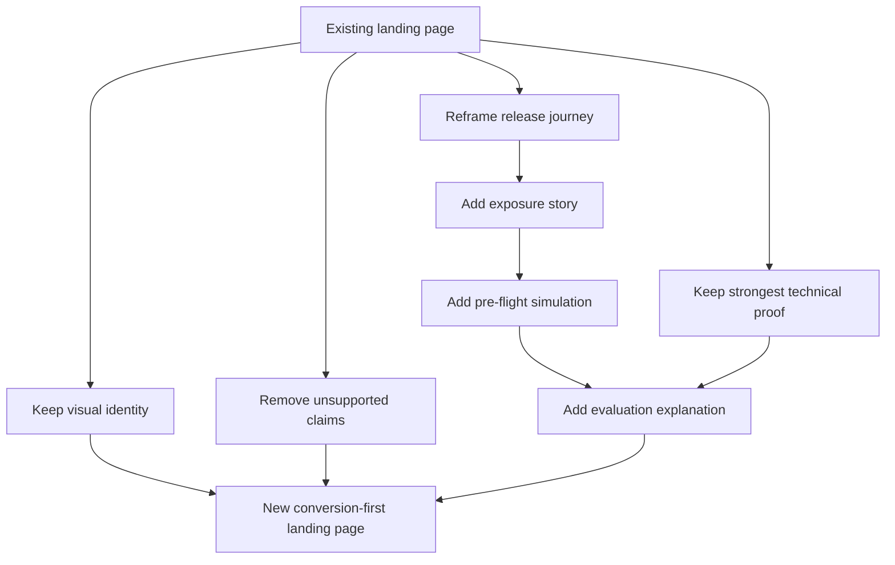

# flags.dev — Landing Page Audit

## 1. Purpose

This document audits the existing landing page against the product thesis, positioning, and release story defined in the product documentation.

The audit covers the landing page only. It evaluates content, product messaging, interaction design, visual language, trust signals, and conversion flow.

It does not define the redesigned page. Redesign decisions belong to the conversion-first wireframe work.

---

## 2. Current Page Structure

```text
Navbar
Hero
Marquee Ticker
Sound Familiar?
Process
Interactive Playground
Comparison
Stats & Testimonials
Pricing
FAQ
Footer / Waitlist
```

The page currently presents flags.dev primarily as a fast, affordable feature-flag service.

---

## 3. Executive Assessment

### Current positioning

The existing page communicates:

> Fast feature flags with targeting, rollout controls, zero redeploys, and low evaluation latency.

It does **not** communicate the current product thesis:

> Understand the exposure created by a release decision before and after changing it.

### Primary gap

The landing page does not contain the product's emerging differentiator: **pre-flight release-impact understanding**.

The page demonstrates feature-flag mechanics, but not the reasoning and exposure analysis around those mechanics.

### Result

A first-time visitor can reasonably conclude that flags.dev is a smaller, cheaper, faster feature-flag platform. The visitor is unlikely to understand why it is different from established alternatives.

---

## 4. Hero Audit

### Current message

**Headline:** `ONE PLAN. ONE FLAG. DONE RIGHT.`

**Supporting message:** Feature activation, safe rollout, target cohorts, zero redeploys, and low edge latency.

**Primary CTA:** `JOIN WAITLIST`

### Assessment

**Status: Replace**

The headline emphasizes packaging and generic quality. The supporting text describes capabilities shared by most feature-flag products.

The hero does not communicate:

- release exposure,
- audience understanding,
- rollout simulation,
- blast-radius analysis,
- or evaluation explanation.

The current hero therefore does not establish the new product thesis.

---

## 5. Problem Narrative Audit

The `SoundFamiliar` section currently focuses on:

- production breakage during deployment,
- slow rollbacks,
- staging/production mismatch,
- engineering dependency for launches,
- accidental feature leaks,
- enterprise pricing.

Most of these are deployment or infrastructure problems rather than release-exposure problems.

The closest existing concept is accidental feature leakage, but it is presented retrospectively rather than as a decision-support problem.

### Required direction

The problem narrative should introduce the uncertainty around a release configuration:

```text
Targeting + rollout
        ↓
Who is affected?
        ↓
How much exposure?
        ↓
What changes if configuration changes?
```

---

## 6. Existing Interactive Experience

### Process section

**Classification: REFRAME**

The current five-step flow demonstrates setup:

```text
Configure → Target → Rollout → Evaluate → Kill switch
```

The mechanics are useful, but the framing is onboarding-oriented.

It should eventually follow the release journey:

```text
Plan → Define audience → Understand exposure → Simulate → Release
```

### Horizontal Playground

The existing sticky/scroll-driven playground is the strongest structural asset on the page and should be retained as the basis for the new product story.

| Scene | Current assessment | Direction |
|---|---|---|
| Activation | Strong concrete demonstration | KEEP |
| Rollback | Repeats activation concept | REBUILD |
| Percentage rollout | Useful foundation but too abstract | REFRAME |
| Targeting | Strong targeting demonstration | KEEP |
| Latency | Strong developer trust signal | KEEP |
| SDK | Strong developer integration signal | KEEP |

### Critical missing scene

The playground currently lacks a **pre-flight impact preview**.

This should become a primary future demonstration:

```text
Current configuration
        ↓
Projected audience
        ↓
Change rollout / targeting
        ↓
Projected exposure delta
```

---

## 7. Four Core Product Questions

| Question | Current support | Assessment |
|---|---|---|
| **WHO?** | Targeting demo shows individual examples | Weak |
| **HOW MUCH?** | Eight anonymous rollout dots | Weak |
| **WHAT IF?** | No preview of configuration changes | Missing |
| **WHY?** | No evaluation trace | Missing |

The current page therefore demonstrates evaluation mechanics but not the four questions that define the new product story.

---

## 8. Product Story Coverage

| Release story | Current page | Assessment |
|---|---|---|
| Build feature | Process section | Weak |
| Plan release | Process section | Weak |
| Define audience | Targeting demo | Partial |
| Understand audience | None | Missing |
| Understand exposure | None | Missing |
| Simulate changes | None | Missing |
| Release / evaluate | Playground | Partial |
| Explain evaluation | None | Missing |
| Make next decision | None | Missing |

The page currently tells a **feature-management story**, not a **release-decision story**.

---

## 9. Capability and Claim Audit

### Existing claims requiring verification before launch

| Claim | Status |
|---|---|
| Feature flags | Real |
| Percentage rollout | Real |
| Rule-based targeting | Real |
| Zero redeploys | Real |
| Kill switch | Real |
| Sub-0.05ms evaluation | Unverified from current audit |
| Multi-SDK support | Unclear / verify published SDKs |
| Real-time telemetry and audit logs | Unclear |
| Edge CDN synchronization | Unclear |
| `$100/mo` flat pricing | Stated intent |
| Dev Care+ add-on | Stated intent |
| OpenFeature | Not currently presented |
| Pre-flight simulation | Planned / not currently implemented |
| Evaluation traces | Planned / not currently implemented |
| Deterministic hashing | Planned / not currently presented |

### Claims that should not be presented as existing proof

The following current social-proof claims are not supported by the audit material and should be removed or replaced before launch:

- `10M+ Daily Flag Evaluations`
- `150+ Engineering Teams`
- `99.999% SLA Uptime`
- `SOC2 Type II Certified`
- Unverified testimonials presented as customer proof

Engineering audiences are particularly likely to challenge unsupported operational claims.

---

## 10. Differentiation Audit

The existing comparison section differentiates on:

- setup time,
- pricing,
- latency,
- targeting,
- zero downtime.

These are useful product attributes but do not establish the new strategic position.

### Current perceived position

```text
Fast
Cheap
Easy feature flags
```

### Desired position

```text
Feature flags
      ↓
Release exposure
      ↓
Pre-flight understanding
      ↓
Better release decisions
```

The differentiation must come from the release-decision workflow rather than simply being cheaper or faster than established vendors.

---

## 11. Business Value Audit

| Value | Current support |
|---|---|
| Reduced release risk | Partial |
| Better rollout decisions | Missing |
| Understanding affected cohorts | Missing |
| Safer progressive delivery | Partial |
| Avoiding unexpected exposure | Missing |
| Faster release decisions | Missing |

The current page communicates operational reliability more strongly than business impact.

---

## 12. Developer Value Audit

| Developer signal | Current support |
|---|---|
| API / SDK | Present |
| Integration simplicity | Present |
| Runtime evaluation | Present |
| Low latency | Strong but requires verification |
| Deterministic evaluation | Missing |
| Evaluation explainability | Missing |
| Operational simplicity | Partial |
| OpenFeature | Missing |

The existing SDK and latency material should be retained as technical proof, but it should support the product story rather than become the story itself.

---

## 13. Trust and Social Proof

### Strong assets

- Real code examples
- SDK presentation
- Concrete latency visualization, once benchmarked
- Public GitHub repository

### Weak or unsafe assets

- Unsupported scale numbers
- Unsupported SLA numbers
- Unsupported certification claims
- Generic testimonials without verifiable attribution
- Illustrative product mockups presented without clear distinction from production UI

### Principle

> **For a developer infrastructure product, unsupported credibility signals are worse than having no social proof.**

Replace unverifiable claims with evidence such as:

- reproducible benchmarks,
- public documentation,
- real product screenshots,
- public repository activity,
- architecture decisions,
- integration examples,
- and verified customer feedback when available.

---

## 14. Conversion Audit

Current primary conversion path:

```text
Landing page
     ↓
Join Waitlist
     ↓
Email capture
```

Current CTAs consistently direct visitors toward the waitlist.

This is appropriate for a pre-launch product, but the page currently asks for commitment without giving visitors a strong enough reason to believe the differentiated product value exists.

### Navigation observations

- `Login` implies an existing user base and should be reconsidered while the product remains pre-launch.
- `Docs` and `GitHub` should be considered as developer trust/navigation destinations.
- The latency badge is a claim rather than useful navigation.

Pricing may remain as a positioning signal, but its feature checklist must be aligned with verified capabilities.

---

## 15. Visual Audit

### Preserve

- Cream/dark alternating section rhythm
- Acid-green accent
- Display + monospace typography pairing
- Handwritten annotation layer
- Sticky playground structure
- SDK code presentation
- Targeting visual
- Latency visualization

These elements create a distinctive developer-native identity and avoid generic SaaS styling.

### Reconsider

- Generic hero headline
- `Official Edge Feature Flag Engine` label
- `100% Zero-Downtime Satisfaction Guarantee` hero badge
- Grid-background treatment
- Fake statistics
- Unverifiable testimonials
- Generic pain-point banner
- Commodity comparison rows
- Anonymous eight-dot rollout visualization

The existing visual identity is strong enough to evolve. A complete visual reset is not required by this audit.

---

## 16. Mobile Audit

The page is broadly responsive, but the strongest interactive experience has a significant mobile limitation: the playground's visual stage is not effectively available in the same form as desktop.

Because the playground is likely to become the primary product demonstration, mobile treatment must be reconsidered during wireframing.

This is a **design problem for #65**, not an implementation task for this audit.

---

## 17. Content Quality

### Strongest existing content

1. Targeting playground scene
2. SDK code scene
3. Latency visualization
4. Accidental feature-leak pain point
5. Concrete latency comparison

### Weakest existing content

1. Hero headline
2. Unsupported statistics
3. Generic testimonials
4. Unsupported SOC2 claim
5. Generic problem-resolution banner

### Feature-listing areas

- Process section
- Pricing feature checklist
- Comparison table
- Marquee ticker

These areas describe what the platform has rather than why the capability matters to the release owner.

---

## 18. Highest-Priority Gaps

The redesign must address these gaps in priority order:

### P0 — Product thesis visibility

The page must clearly communicate release exposure as the central problem.

### P0 — Pre-flight impact preview

Visitors must see a concrete example of understanding exposure before changing a rollout.

### P0 — Four core questions

The experience should communicate:

```text
WHO?
HOW MUCH?
WHAT IF?
WHY?
```

### P1 — Honest proof

Remove unsupported scale, certification, SLA, and testimonial claims. Replace them with verifiable evidence.

### P1 — Product differentiation

Replace commodity comparison messaging with release-specific differentiation.

### P1 — Context-rich rollout visualization

The rollout demonstration should show meaningful context and exposure rather than anonymous dots.

### P2 — Evaluation explainability

Introduce the concept of an evaluation trace and why it matters.

### P2 — Developer trust/navigation

Improve access to documentation, repository information, and verified technical evidence.

### P2 — Mobile product demonstration

Ensure the core product story remains understandable without relying on a desktop-only interactive stage.

---

## 19. Recommended Reuse Strategy

The current page should be **evolved, not discarded**.



The existing playground structure is the most valuable reusable implementation asset.

---

## 20. Audit Conclusion

The current landing page is visually distinctive and technically oriented, but its product narrative is now outdated.

It currently sells:

> **Fast, affordable feature flags.**

The product positioning requires it to sell:

> **Understanding the exposure created by a release decision.**

The primary redesign objective is therefore **not to make the page prettier**. It is to make the existing visual language communicate the new product story.

The next step is a conversion-first wireframe that determines how the story should be experienced from first impression through conversion.
