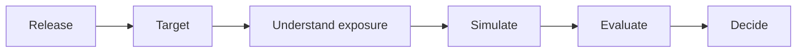
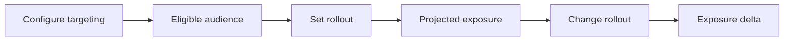
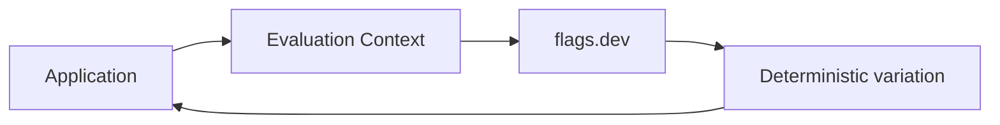
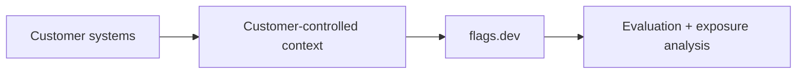

# flags.dev — Conversion-First Landing Page Wireframe

## 1. Purpose

This document defines the conceptual structure of the flags.dev landing page before copywriting, visual design, and implementation.

The landing page should communicate the product story established in the product thesis, positioning, and release story documents. It is not a component specification.

---

## 2. Conversion Objective

The primary conversion goal is to move a qualified engineering visitor from:

```text
I need to control a release.
        ↓
I need to understand its exposure.
        ↓
flags.dev can show me that.
        ↓
I trust the approach.
        ↓
I want to try it.
```

The page should not optimize for maximum feature coverage. It should optimize for **problem recognition, product understanding, trust, and action**.

---

## 3. Core Narrative

The page follows the customer's release journey:



The visitor should encounter this progression naturally while scrolling.

---

## 4. Page Architecture

```text
1. Navigation
2. Hero — The release problem
3. Problem — Control is not understanding
4. Interactive release preview — The aha moment
5. Release workflow — Who / How much / What if / Why
6. Developer experience — Put the decision in the application
7. Engineering proof — Why the platform can be trusted
8. Product boundaries / trust — What flags.dev does and does not do
9. FAQ — Resolve adoption objections
10. Final CTA — Start using flags.dev
11. Footer
```

The exact visual treatment and final copy are intentionally deferred to later issues.

---

## 5. Section 1 — Navigation

### Purpose

Provide access to essential destinations without competing with the primary conversion goal.

### Required navigation concepts

- Product / how it works
- Developer documentation
- GitHub / source repository where appropriate
- Sign in
- Primary product CTA

### Principle

Navigation should remain lightweight. The landing page should not feel like a documentation portal.

---

## 6. Section 2 — Hero: The Release Problem

### Purpose

Create immediate problem recognition.

### Visitor should understand

> Feature flags provide release control, but teams still need to understand what a rollout will affect.

### Hero structure

```text
Problem-oriented headline
        ↓
Short explanation of the outcome
        ↓
Primary CTA + secondary developer CTA
        ↓
Minimal visual hint of release → audience → exposure
```

### Requirements

- Must communicate the differentiated problem, not merely "feature flags."
- Must not lead with infrastructure terminology.
- Must not claim unimplemented capabilities as available.
- Must make the next section feel like the answer to the problem.

---

## 7. Section 3 — Problem: Control Is Not Understanding

### Purpose

Make the visitor recognize the gap between configuring a rollout and understanding its impact.

### Narrative

Use one concrete release scenario rather than a generic list of pain points.

```text
new-checkout

India · PRO · Android
15% rollout

        ↓

What does this actually affect?
```

Then introduce the four questions:

```text
WHO?
Who matches this release?

HOW MUCH?
How much exposure will it create?

WHAT IF?
What changes if targeting or rollout changes?

WHY?
Why did this context receive this variation?
```

### Principle

The section should create curiosity for the interactive preview rather than attempt to explain the entire platform.

---

## 8. Section 4 — Interactive Release Preview

### Purpose

Deliver the primary product aha moment.

This should be the most important interactive element on the page.

### Concept

The visitor sees a release configuration and its projected exposure.

```text
┌──────────────────────────────────────┐
│ new-checkout                         │
│                                      │
│ Target                               │
│ India · PRO · Android                │
│                                      │
│ Eligible contexts                    │
│              420,000                 │
│                                      │
│ Rollout                              │
│ ─────────────●────────────── 15%     │
│                                      │
│ Projected exposure                   │
│               ~63,000                │
└──────────────────────────────────────┘
```

The visitor should be able to change rollout or targeting in the demonstration and see the projected impact change.

### Required interaction



### Importance

This interaction should communicate the product thesis faster than a feature list or product screenshot.

### Truth boundary

If the underlying capability is not implemented, the experience must be clearly presented as a product concept/demo rather than a live customer calculation.

---

## 9. Section 5 — Release Workflow

### Purpose

Turn the aha moment into a coherent product model.

### Structure

```text
01  Define context
        ↓
02  Target audience
        ↓
03  Understand exposure
        ↓
04  Simulate changes
        ↓
05  Evaluate deterministically
        ↓
06  Explain decisions
```

Each step should answer one customer question.

| Step | Customer question | Product capability |
|---|---|---|
| Context | What information defines the audience? | Evaluation Context |
| Target | Who should receive the release? | Targeting |
| Exposure | How much will be affected? | Exposure analysis |
| Simulate | What changes if I alter the configuration? | Impact simulation |
| Evaluate | What does the application receive? | Deterministic evaluation |
| Explain | Why did this context receive it? | Evaluation explanation |

### Principle

This section explains the product as a connected workflow rather than six unrelated features.

---

## 10. Section 6 — Developer Experience

### Purpose

Show that the product is built for developers and can be integrated into real applications.

### Existing assets to reuse where appropriate

- API examples
- Java SDK direction
- Evaluation examples
- Application preview
- Existing interactive SDK visualization

### Conceptual flow



### Principle

Developer experience should appear after the visitor understands the product value. Integration is proof of usability, not the primary product story.

---

## 11. Section 7 — Engineering Proof

### Purpose

Convert product interest into technical trust.

### Proof categories

Only verified capabilities and measured results should be shown.

Potential categories include:

- deterministic evaluation
- Redis-backed evaluation/cache behavior
- cache resilience
- tenant isolation
- API-key authentication
- evaluation contract tests
- performance/latency measurements
- SDK/API integration

### Principle

Show evidence instead of unsupported claims.

Avoid fabricated adoption numbers, SLAs, compliance certifications, testimonials, or benchmark claims.

---

## 12. Section 8 — Product Boundaries and Trust

### Purpose

Resolve concerns about data ownership and platform coupling.

### Core message

flags.dev should work through an explicit context contract and should not require direct access to a customer's database.



### Questions to address

- Does flags.dev require direct database access?
- Is flags.dev replacing the customer's analytics platform?
- Is every exposure number exact?
- What data is supplied to the platform?

### Principle

Trust should be established through clear boundaries, not vague privacy claims.

---

## 13. Section 9 — FAQ

### Purpose

Remove remaining adoption friction without interrupting the main narrative.

Potential questions:

- What is flags.dev?
- How is it different from a traditional feature-flag platform?
- Does it require access to my database?
- What is an Evaluation Context?
- How does percentage rollout work?
- Are exposure numbers exact or estimated?
- How does evaluation remain deterministic?
- How do I integrate flags.dev into my application?
- What is available today?

Only questions relevant to actual product objections should remain in the final page.

---

## 14. Section 10 — Final CTA

### Purpose

Convert a visitor who understands the product and trusts the approach.

### CTA principle

The CTA should describe the product action rather than use generic language where possible.

Potential directions:

- Create your first flag
- Start your first release
- Try flags.dev

Final wording is deferred to the copywriting issue.

---

## 15. Section 11 — Footer

### Required concepts

- Documentation
- GitHub
- Product links
- Authentication
- Legal links where applicable

The footer should not introduce new product claims.

---

## 16. Existing Frontend Mapping

The current landing page contains reusable assets that should be evaluated against this structure rather than discarded automatically.

| Existing asset | Intended treatment |
|---|---|
| Horizontal playground | Preserve and reframe around release impact |
| Targeting visualization | Preserve; connect it to audience/exposure |
| Rollout visualization | Preserve; make the consequence of rollout the focus |
| SDK scene | Preserve; move into developer experience |
| Latency scene | Reframe as engineering proof |
| Application preview | Preserve as product-in-context proof |
| Generic feature sections | Rework around customer questions |
| Unsupported stats/testimonials | Remove unless verified |
| Generic comparison table | Reconsider; differentiation should be problem/outcome-based |
| Pricing | Retain only if the pricing model is credible and useful for conversion |

---

## 17. Visual Hierarchy

The page should have one dominant visual idea:

> **A release configuration changing the expected exposure.**

The visual hierarchy should follow:

```text
Problem
  ↓
Interactive aha moment
  ↓
Product workflow
  ↓
Developer integration
  ↓
Technical proof
  ↓
Trust / objections
  ↓
CTA
```

The page should avoid presenting every capability with equal visual weight.

---

## 18. Conversion Principles

1. **Problem before features.**
2. **Demonstration before explanation where possible.**
3. **One primary aha moment.**
4. **Every major section answers a customer question.**
5. **Technology follows product value.**
6. **Use concrete release scenarios instead of generic SaaS language.**
7. **Do not overload the page with feature lists.**
8. **Do not use unsupported social proof or performance claims.**
9. **Make current vs. planned functionality clear.**
10. **End with a clear product action.**

---

## 19. What This Wireframe Deliberately Does Not Decide

The following are deferred:

- final headline and body copy,
- exact CTA wording,
- typography and color changes,
- animation style,
- exact component implementation,
- responsive implementation details,
- final pricing presentation,
- final FAQ wording.

These belong to subsequent issues.

---

## 20. Success Criteria

The wireframe is successful if a first-time visitor can progress through this mental model:

```text
I have a release.
        ↓
I need controlled exposure.
        ↓
I need to understand that exposure.
        ↓
I can see the impact before changing it.
        ↓
I understand how the application evaluates it.
        ↓
I trust the engineering behind it.
        ↓
I know what to do next.
```

The page should make the product understandable without requiring prior knowledge of the internal architecture or the feature-flag ecosystem.
