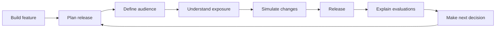
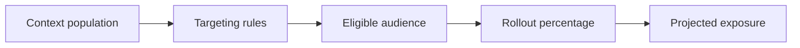
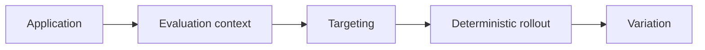
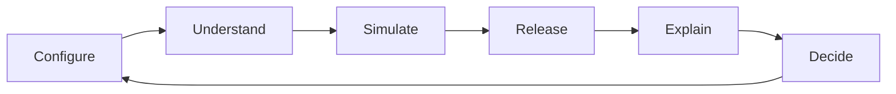

# flags.dev — Product Release Story

## 1. Purpose

This document defines the product narrative that connects the customer problem, flags.dev capabilities, and the desired release experience.

It is the conceptual foundation for the landing page and product experience. It does not define UI structure, copy, visual design, or implementation details.

---

## 2. The Customer's Goal

A team has built a feature and wants to release it safely.

The immediate requirement is to control exposure without requiring every user to receive the feature at once.

The team therefore creates a feature flag, defines targeting, and chooses a rollout strategy.

The problem begins when the team needs to understand the consequences of that configuration.

The release questions are:

- Who will receive the feature?
- How much of the available audience will be exposed?
- Which cohorts are affected?
- What changes if targeting changes?
- What changes if rollout increases?
- Why did a particular context receive a variation?

The product story must make these questions visible and show how flags.dev helps answer them.

---

## 3. Narrative in One Sentence

> **flags.dev helps teams understand the exposure created by a feature-release decision before and after they change it.**

Feature flags provide the control mechanism. Context-aware evaluation and release analysis provide the understanding.

---

## 4. The Release Journey

The product narrative follows the customer's release journey rather than the internal architecture of flags.dev.



Each stage answers a concrete release question.

| Stage | Customer question | flags.dev role |
|---|---|---|
| Plan release | What are we releasing and where? | Flag and environment configuration |
| Define audience | Who should receive it? | Context-aware targeting |
| Understand exposure | How much of the available audience is affected? | Audience and exposure analysis |
| Simulate changes | What happens if we change rollout or targeting? | Release-impact simulation |
| Release | What should the application return? | Deterministic evaluation |
| Explain evaluations | Why did this context receive this variation? | Evaluation reasoning |
| Make next decision | Should we expand, hold, or change the release? | Release-specific insight |

---

## 5. Act I — The Release Problem

The team has completed a feature and is ready to release it.

A full release may be too risky, so the team chooses controlled exposure:

```text
Feature
  ↓
Feature flag
  ↓
Target audience
  ↓
Percentage rollout
```

This is the established feature-flag workflow.

The product story should not imply that basic feature-flag control is the problem. The problem is the uncertainty that remains around the consequences of that control.

---

## 6. Act II — The Missing Visibility

Consider a release configured as:

```text
Flag:       new-checkout
Country:    India
Plan:       PRO
Platform:   Android
Rollout:    15%
```

A basic evaluator can determine whether an individual context receives the feature.

The release owner may still need to know:

```text
How many available contexts match?
How many are expected to receive the feature?
Which cohorts are affected?
What happens at 25% instead of 15%?
```

This is the central narrative transition:

> **A rollout percentage is a control. It is not an explanation of release impact.**

---

## 7. Act III — Understand the Audience

The first product value is understanding who matches the release configuration.

```text
Targeting
────────────────────────
Country      India
Plan         PRO
Platform     Android
────────────────────────

Available matching contexts
              420,000
```

The product should connect targeting conditions to the resulting population instead of presenting targeting as an isolated configuration form.

The source and freshness of the population must be clear whenever the value is estimated.

---

## 8. Act IV — Understand Exposure

The next question is how much of the matching audience the rollout exposes.

```text
Matching contexts       420,000
Rollout                     15%

Projected exposure       ~63,000
```

The product should make the relationship between targeting and rollout explicit:



This is the first major differentiation from a simple flag-management workflow.

---

## 9. Act V — Simulate Before Changing

A release owner considers increasing rollout from 15% to 25%.

Instead of requiring the configuration to be changed before its impact can be understood, flags.dev should make the consequence visible first.

```text
Current rollout        15%        ~63,000
Proposed rollout       25%       ~105,000

Additional exposure              ~42,000
```

The same principle applies to targeting changes:

```text
Current targeting      420,000
Add plan = ENTERPRISE    82,000

Audience change        -80.5%
```

The product experience should answer:

> **What changes if I change the release?**

before requiring the customer to commit the change.

---

## 10. Act VI — Execute the Release

After the release owner understands the expected exposure, the application evaluates the flag using the same targeting and rollout semantics.



The evaluation engine is the authoritative mechanism for the runtime decision.

Audience analysis must not be required for basic evaluation.

---

## 11. Act VII — Explain the Decision

A release does not end when a variation is returned.

When an engineer needs to understand an individual decision, flags.dev should expose the reasoning path.

Example:

```text
Context: user-123

country = IN             ✓
plan = PRO               ✓
platform = ANDROID      ✓

Matched targeting rule   ✓
Rollout bucket            12.4%
Configured rollout        15%

Variation                 ON
```

The goal is to answer:

> **Why did this context receive this variation?**

This creates a direct connection between the configuration used for simulation and the evaluation semantics used at runtime.

---

## 12. Act VIII — Make the Next Decision

The release owner can now decide whether to:

- increase rollout,
- hold the current exposure,
- change targeting,
- investigate an unexpected cohort,
- or roll back.

The product loop therefore becomes:



The purpose of the loop is not to automate release decisions. It is to provide enough context for teams to make better decisions themselves.

---

## 13. The Product Aha Moment

The primary product realization should be:

> **“I can see what this release will actually affect before I change the rollout.”**

A visitor should be able to understand the value through a concrete release scenario rather than through a list of platform features.

The ideal interaction demonstrates:

```text
Targeting
   ↓
Eligible audience
   ↓
Rollout
   ↓
Projected exposure
   ↓
Change rollout
   ↓
Changed exposure
```

This interaction represents the core product thesis more effectively than a generic feature-flag dashboard.

---

## 14. Product Story vs. Technology Story

The customer story must lead with the release problem and outcome.

### Product story

> Understand who your release affects and how configuration changes alter that exposure.

### Technology proof

The platform can then substantiate the experience with:

- deterministic evaluation,
- context-aware targeting,
- Redis-backed evaluation infrastructure,
- tenant isolation,
- API security,
- SDK support,
- evaluation contract testing,
- and production-oriented performance characteristics.

Technology exists to establish trust in the solution. It is not the opening narrative.

---

## 15. Story Boundaries

The narrative should not position flags.dev as:

- a generic analytics platform,
- a customer data platform,
- a data warehouse,
- a replacement for product analytics,
- a generic experimentation suite,
- or a feature-count competitor to established feature-flag vendors.

The story must remain centered on **release exposure and release decisions**.

---

## 16. Truth and Capability Boundaries

The product story must distinguish between capabilities that are available today and capabilities that represent the product direction.

### Current or foundational capabilities

These may be presented as product functionality when implemented and verified:

- feature-flag management,
- environments,
- targeting primitives,
- evaluation APIs,
- deterministic evaluation,
- production-oriented evaluation infrastructure.

### Planned capabilities

These belong to the future product narrative until implemented and verified:

- context-aware evaluation model,
- percentage rollout,
- audience analysis,
- exposure estimation,
- rollout simulation,
- targeting-impact analysis,
- explainable evaluation,
- Java SDK,
- OpenFeature provider.

The landing page may communicate the product direction, but it must not present planned functionality as generally available functionality.

---

## 17. Narrative Principles

1. **The customer is the protagonist.** The story follows a team making a release decision.
2. **Lead with the problem, not the implementation.** Infrastructure is supporting evidence.
3. **Show consequences, not configuration alone.** A rollout percentage becomes meaningful when its exposure is visible.
4. **Use concrete scenarios.** Release examples are easier to understand than abstract platform terminology.
5. **Connect configuration to outcome.** Targeting, rollout, exposure, and evaluation should feel like one continuous system.
6. **Make uncertainty explicit.** Estimated exposure must be presented as an estimate when the underlying population is not authoritative or complete.
7. **Do not overclaim.** Product direction and implemented capability must remain distinguishable.
8. **Keep the narrative release-specific.** Generic analytics capabilities are outside the story unless they directly improve release decisions.

---

## 18. North-Star Narrative

The complete product story can be summarized as:

> **A team is preparing a release. flags.dev helps them define who should receive it, understand how much exposure that creates, simulate changes before applying them, execute the decision deterministically, and explain individual evaluations afterward.**

The resulting product loop is:

```text
Control the release
        ↓
Understand the exposure
        ↓
Make the decision
        ↓
Execute deterministically
        ↓
Understand the result
        ↓
Make the next decision
```

This narrative is the foundation for the landing-page experience and should remain consistent across product messaging, demonstrations, and developer documentation.
