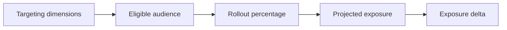
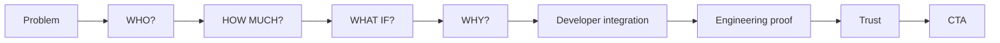

# flags.dev — Landing Page Visual Direction

## 1. Purpose

This document defines the visual and interaction language for the flags.dev landing page.

The objective is to make the product story immediately understandable, credible, and distinctive while preserving the existing brand identity where it remains effective.

The design should communicate a **precision infrastructure tool that happens to be beautiful**: technical, developer-native, premium, deliberate, and bold without becoming playful or visually excessive.

---

## 2. Design North Star

> **Every visual element must explain the release problem, demonstrate the product, or establish trust. If it does none of these, it does not belong.**

The page should make the core product insight tangible:

> **Know what your release will affect before you change it.**

The live impact preview is the primary visual proof of that promise.

---

## 3. Existing Identity to Preserve

The redesign should evolve the current visual system rather than replace it.

### Preserve

- Dark/off-white dual-tone backgrounds: `#131311` and `#fffdf6`
- Chartreuse brand accent around `#c6fd50`
- Satoshi display typography
- Inter for body copy
- JetBrains Mono for code, labels, and technical metadata
- Horizontal sticky playground concept
- Dark treatment for the interactive product section
- Step pills in the playground header
- Monospace technical metadata
- Rounded cards with subtle borders
- Inline controls that visibly affect the associated product state
- Strong contrast between narrative and product sections

### Remove or substantially rework

- Handwritten Sedgwick Ave annotations
- Generic motivational hero language
- Generic DevOps pain-point quotations
- Generic five-step feature/process cards
- Unverified statistics and testimonials
- Consumer-style guarantee badges
- Content-free marquee/ticker elements
- Excessive vertical whitespace where the content does not justify it
- Accidental-looking dark-green gradient treatment in the hero

---

## 4. Brand Personality

| Dimension | Target |
|---|---:|
| Technical | 5/5 |
| Minimal | 4/5 |
| Bold | 4/5 |
| Playful | 1/5 |
| Premium | 4/5 |
| Enterprise | 2/5 |
| Developer-native | 5/5 |
| Futuristic | 3/5 |
| Calm | 3/5 |
| Experimental | 2/5 |

The intended position is **familiar category + distinctive execution**.

Visitors should recognize a feature-flag product quickly while immediately seeing that flags.dev has a different emphasis: release exposure and release decisions.

The visual language should avoid both extremes:

- generic enterprise feature-flag SaaS,
- an experimental visual identity so unusual that the category becomes unclear.

---

## 5. Color System

The existing palette remains the foundation.

| Role | Direction |
|---|---|
| Dark surface | `#131311` |
| Light surface | `#fffdf6` |
| Brand accent | Chartreuse around `#c6fd50` |
| Exposure increase | Muted amber around `#f5a623` when caution is required |
| Rule conflict | Muted red around `#ff6b6b` |
| OFF / inactive | Low-opacity neutral treatment |

The interface should remain predominantly monochrome. Semantic colors should appear only when they communicate state.

Chartreuse should remain the primary identity and positive/on state. Semantic color must not turn the page into a conventional dashboard palette.

---

## 6. Typography

Use no more than three type families/roles:

- **Satoshi Black** — display and major headings
- **Inter Regular/Medium** — body and supporting copy
- **JetBrains Mono** — code, labels, metadata, technical values, evaluation traces

Sedgwick Ave Display and handwritten annotations are removed from the visual language.

Typography should feel confident and precise rather than decorative.

---

## 7. Hero Direction

The hero should use a split-screen composition.

```text
┌──────────────────────────────┬─────────────────────────────┐
│                              │                             │
│  Product promise             │  Impact Preview             │
│  Supporting explanation      │                             │
│  Primary CTA                 │  Flag + targeting           │
│                              │  Rollout + exposure         │
│                              │                             │
└──────────────────────────────┴─────────────────────────────┘
```

The right side should contain a simplified but realistic **Impact Preview** rather than a static marketing illustration.

The preview should be visible immediately and demonstrate the product concept before the visitor scrolls.

Example state:

```text
checkout-v2

India · PRO · Android

15% rollout
────────────────────
Eligible contexts       420K
Projected exposure       63K
Enterprise affected        0
Rule conflicts             3
```

Numbers may count up on initial load for approximately three seconds. The animation exists to establish attention and hierarchy, not spectacle.

---

## 8. Central Aha Interaction

The primary interactive centerpiece should combine **targeting controls and rollout simulation**.

The visitor can:

1. Toggle targeting dimensions.
2. Change rollout percentage.
3. Observe audience and exposure metrics update immediately.
4. Expand an evaluation trace to understand an individual decision.

This should feel like an almost-product-level simulation while remaining entirely self-contained on the marketing page.

### Interaction level

Target **4/5 — almost a mini-product**.

It should be a real interactive demonstration, but it must not require authentication, backend connectivity, or a complex setup flow.

### Core state relationship



No submit button is required. Changes should be immediate and deterministic.

---

## 9. Impact Preview Data

The centerpiece should prioritize a small number of meaningful signals.

### Primary

- Projected exposure
- Exposure delta

### Secondary

- Eligible context count
- Audience percentage
- Plan distribution
- Rule conflict count
- Enterprise exposure safety signal

### Exclude from the primary interaction

- Country distribution charts
- Platform distribution charts
- Large multi-dimensional dashboards
- Dense analytics breakdowns

The first number should always win visually:

```text
63K
projected exposure
```

Secondary context may show:

```text
PRO 61%   Enterprise 0%   Starter 39%
```

---

## 10. WHO / HOW MUCH / WHAT IF / WHY

The four core product questions become recurring visual primitives.

### WHO?

Use interactive cohort chips with count/context affordances.

```text
[ India × ] [ PRO plan × ] [ Android × ]
```

Toggling a dimension changes the audience/exposure state.

### HOW MUCH?

Use one dominant number with a compact delta indicator.

```text
63K
projected exposure
+26K at 25%
```

Avoid donuts and dashboard-style charts in the marketing experience.

### WHAT IF?

Use an inline diff driven by the rollout control.

```text
15%  →  25%
63K      89K
         +26K
```

The visitor should see causality immediately as the control moves.

### WHY?

Use a compact, code-like evaluation trace.

```text
Rule 1: country == "IN"       ✓ match
Rule 2: plan == "PRO"         ✓ match
Rule 3: bucket_hash < 0.15     ✓ pass
→ Variation: ON
```

The trace is collapsed by default and expands on demand.

---

## 11. Product UI Authenticity

Marketing components should be **simplified but realistic**.

They should feel like a composed view of the actual product rather than a screenshot of a dashboard.

Requirements:

- believable controls,
- realistic terminology,
- internally consistent values,
- coherent evaluation semantics,
- no impossible states,
- no unnecessary navigation or scrollbars.

The marketing component language should remain intentionally stable even if the application UI evolves.

---

## 12. Demo Data

The landing-page simulation should use **static deterministic demo data**.

The design must not depend on a live backend or authenticated customer data.

The dataset should be deliberately constructed so that:

- targeting changes produce coherent audience changes,
- rollout changes produce coherent exposure changes,
- the displayed delta is consistent,
- safety and conflict signals have an understandable relationship to the scenario.

The same interaction should produce the same result on every visit.

---

## 13. Motion Principles

Target motion level: **3/5 — moderate**.

Motion should communicate:

- causality,
- state changes,
- attention hierarchy,
- relationships between configuration and outcome.

Examples:

```text
Rollout changes
      ↓
Exposure recalculates
      ↓
Delta updates
```

```text
Targeting chip toggles
      ↓
Audience changes
      ↓
Exposure changes
```

Avoid motion whose primary purpose is decoration.

Scroll-driven motion should be limited to major story transitions, particularly the existing horizontal playground. The hero and primary impact interaction should respond directly to user controls rather than requiring scrolling to operate.

---

## 14. Data Visualization Language

The marketing page is **numbers-first**, with a small number of structural flows.

Preferred primitives:

- large numbers,
- compact deltas,
- cohort chips,
- inline comparisons,
- one evaluation-flow/trace visualization.

Avoid dashboard-heavy charting unless a chart is necessary to explain a specific relationship.

The landing page should communicate the product insight faster than a conventional analytics dashboard can.

---

## 15. Product-to-Marketing Ratio

Target approximately **60% product-oriented visual content** across the full page.

Indicative distribution:

| Section | Product visual emphasis |
|---|---:|
| Hero | ~40% |
| Interactive release section | ~90% |
| Narrative/problem sections | ~10% |
| Comparison | ~30% |
| Engineering proof | ~80% |
| Pricing/footer | ~0% |

The ratio is directional, not a literal pixel or component-count requirement.

---

## 16. Trust Design

Credibility should be established in this order:

1. Product interaction
2. Real code examples
3. Verified metrics/benchmarks
4. Architecture evidence
5. Open-source repository
6. Documentation
7. Security information
8. Customer logos, only if real
9. Testimonials, only if real

Engineering metrics belong primarily in a lower-page technical proof section rather than the hero.

Example presentation:

```text
< 10ms p99 evaluation latency
Deterministic bucket hashing
Redis-backed rule cache
OpenFeature-compatible SDK
```

**Only verified capabilities and measurements may be presented as facts.**

---

## 17. Engineering Proof Visual Language

The engineering proof section should feel more technical than the narrative sections.

Use:

- compact monospace labels,
- code snippets,
- measured values,
- concise architecture diagrams,
- restrained borders and surfaces.

Do not use decorative claims or exaggerated enterprise language.

The role of this section is to answer:

> **Can I trust this system enough to put it into my release path?**

---

## 18. Section Transitions

Sections should form a continuous reasoning chain rather than independent marketing blocks.



Transitions should reinforce causality:

> Who receives it? → How much is exposed? → What changes? → Why did this context receive it?

---

## 19. Responsive Design

The primary interaction must remain understandable on mobile without reproducing the desktop dashboard literally.

Desktop may use a wide simulation panel.

Mobile should preserve the essential relationship:

```text
15% rollout
     ↓
63K exposure

25% rollout
     ↓
89K exposure

+26K
```

Targeting controls should collapse into a compact, touch-friendly control group. Evaluation traces should remain expandable rather than forcing dense desktop layouts into narrow screens.

---

## 20. Accessibility

The interaction design must support:

- keyboard-accessible controls,
- visible focus states,
- semantic headings,
- accessible labels for rollout controls,
- non-color indicators for important states,
- sufficient contrast,
- reduced-motion behavior.

The rollout slider is a functional control and must not depend exclusively on visual dragging.

---

## 21. Performance Constraints

Visual design must not compromise the credibility of the engineering product.

Avoid:

- large video backgrounds,
- unnecessarily heavy animation dependencies,
- oversized image assets,
- WebGL without a clear product purpose,
- animation that blocks initial content rendering.

The landing page should load and become useful quickly.

---

## 22. Explicit Design Decisions

1. Preserve the current dark/off-white and chartreuse identity.
2. Remove handwritten typography and decorative annotations.
3. Position the visual language as technical, developer-native, premium, and bold.
4. Keep the category recognizable while making the product experience distinctive.
5. Use a split-screen hero with an immediate Impact Preview.
6. Make the release-impact simulation the primary visual centerpiece.
7. Combine targeting controls and rollout simulation in the centerpiece.
8. Use deterministic static demo data for the marketing interaction.
9. Make numbers, deltas, chips, and evaluation traces the primary visualization primitives.
10. Use motion to communicate causality rather than decoration.
11. Keep the product UI simplified but realistic.
12. Use restrained semantic colors and preserve chartreuse as the brand/positive state.
13. Keep engineering proof below the primary product narrative.
14. Preserve the existing horizontal playground mechanic while replacing its content with the release-impact story.
15. Design mobile as a first-class representation of the interaction rather than a compressed desktop dashboard.
16. Treat accessibility and performance as design constraints, not implementation cleanup.
17. Present only verified product capabilities, metrics, and trust claims.

---

## 23. Visual North Star

The redesigned page should make the visitor experience one clear realization:

> **I changed the release configuration, and I immediately saw what that change would affect.**

The live impact preview is therefore not an illustration of the product. It is the central visual demonstration of the product's value.
